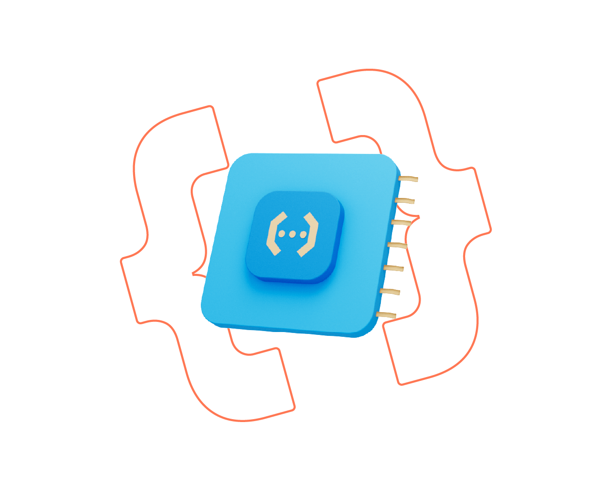

# Shapeless — Based on Jstack  
**Build fast, lightweight, and end-to-end typesafe Next.js apps**

Powered by:
- **Next.js 15**
- **Hono**
- **Tailwind CSS v4**
- **OpenNext (for Cloudflare Workers)**
- **Drizzle ORM**



## 🚀 About

Thanks for checking out **Shapeless**. It’s a modern, modular stack designed to help you build full-featured apps quickly—without sacrificing type safety or flexibility.

For documentation and full feature overview, visit:  
🔗 [shapeless.pherus.org](https://shapeless.pherus.org/)

Created by [@la-niina](https://github.com/la-niina)

---

## 🛠 Usage

**Shapeless CLI** – Quickly bootstrap a new app with the full stack and your preferred template.

Choose one of the following commands to get started:

```bash
pnpm dlx create-shapeless-app
````

```bash
bunx create-shapeless-app
```

```bash
npm create shapeless-app@latest
```

```bash
yarn create shapeless-app
```

You’ll be prompted to select a template and features tailored to your project.

---

## 🧩 Roadmap / Planned Features

We’re evolving Shapeless into a fully modular, headless CMS–style toolkit—optimized for both Cloudflare and self-hosted environments.

* <input type="checkbox" checked /> Cloudflare Workers support (via OpenNext)
* <input type="checkbox" />  Admin studio & management dashboard
* <input type="checkbox" /> Support for auth (2FA, OAuth, etc.)
* <input type="checkbox" /> OpenAPI integration for auto-generated API docs
* <input type="checkbox" /> Visual schema builder using React Flow
* <input type="checkbox" /> CLI-based plugin system to scaffold workflows and add new tools

---

## 🙌 Acknowledgements

Shapeless is inspired by and built with the help of these amazing tools:

* [T3 Stack](https://github.com/t3-oss/create-t3-app)
* [tRPC](https://trpc.io/)
* [Hono](https://hono.dev/)
* [Jstack](https://jstack.app/)

And a big shoutout to all contributors and early adopters. You rock.

---

## 📄 License

[MIT License](https://choosealicense.com/licenses/mit/)
